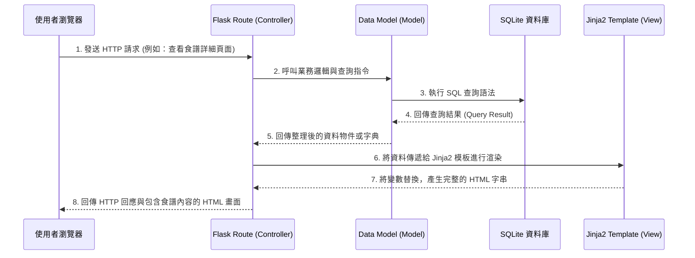

# 系統架構文件 (Architecture) - 食譜收藏夾系統

本文件基於產品需求文件 (PRD) 定義「食譜收藏夾系統」的技術架構與資料夾組織結構，作為後續開發的指引。

## 1. 技術架構說明

為了快速打造且維護這個直覺且專注的食譜收藏平台，我們選擇了以下技術棧：

- **後端框架**：Python + Flask
  - 輕量級且易於上手的框架，適合中小型應用快速開發。
  - 我們將採用 **MVC（Model-View-Controller）** 模式的變體來組織 Flask 專案：
    - **Model (模型)**：負責定義資料結構與資料庫互動邏輯（如食譜、使用者資料），透過直接使用 `sqlite3` 模組或輕量 ORM 進行操作。
    - **View (視圖)**：負責前端畫面的呈現，由 Jinja2 模板引擎與 HTML/CSS/JavaScript 共同組成。
    - **Controller (控制器)**：由 Flask 的路由（Routes）負責，接收使用者的 HTTP 請求、從 Model 取得資料並將資料傳遞給 View 渲染，最後回傳給瀏覽器。
- **模板引擎**：Jinja2
  - 與 Flask 緊密整合，負責將後端的資料動態渲染到 HTML 頁面中，不採用前後端分離架構，以降低初期開發與部署複雜度。
- **資料庫**：SQLite
  - 輕量級關聯式資料庫，無需獨立伺服器即可運作，適合 MVP 階段。所有資料存在單一檔案（如 `database.db`）中，備份與轉移方便。

## 2. 專案資料夾結構

整個專案將按照功能與職責進行劃分，以下是預期的資料夾結構與說明：

```text
web_app_development/
├── app.py                 # 應用程式的入口點（設定 Flask app、註冊路由 Blueprint）
├── requirements.txt       # 專案相依套件清單 (例如: flask, werkzeug)
├── README.md              # 專案介紹文件
├── docs/                  # 專案相關文件 (PRD, 架構文件, 流程圖等)
├── instance/              
│   └── database.db        # SQLite 資料庫檔案 (運行時產生，不會被提交至版本控制)
└── app/                   # 主程式目錄
    ├── models/            # [Model] 資料庫模型與資料處理邏輯
    │   ├── user.py        # 使用者 (一般用戶、管理員) 模型與 CRUD
    │   └── recipe.py      # 食譜 (食材、作法) 模型與 CRUD
    ├── routes/            # [Controller] Flask 路由設定
    │   ├── auth.py        # 註冊、登入、登出相關路由
    │   ├── recipes.py     # 瀏覽、搜尋、詳細頁與收藏相關路由
    │   └── admin.py       # 管理員專屬的審核與管理路由
    ├── templates/         # [View] Jinja2 HTML 模板
    │   ├── base.html      # 網站共用版型 (導覽列、頁尾、head 資源)
    │   ├── auth/          # 登入、註冊相關頁面
    │   └── recipes/       # 食譜列表、詳細內容、表單頁面
    └── static/            # [View] 靜態資源檔案
        ├── css/           # 自訂的樣式表 (style.css)
        ├── js/            # 自訂的 JavaScript 腳本 (main.js)
        └── img/           # 預設圖片與靜態資源
```

## 3. 元件關係圖

以下是系統運作的請求與回應流程，展示了瀏覽器、Flask、Jinja2 與 SQLite 之間的互動關係。



## 4. 關鍵設計決策

1. **採用伺服器端渲染 (Server-Side Rendering)**：
   考量到這是 MVP 開發階段，我們決定不使用 React/Vue 等前端框架進行前後端分離。透過 Flask 加上 Jinja2 進行伺服器端渲染，可以省去 API 溝通的複雜度，大幅提升開發速度，且對於文章/食譜類型的網站有利於搜尋引擎最佳化 (SEO)。

2. **模組化的路由設計 (Flask Blueprints)**：
   我們將 `routes` 資料夾按功能分為 `auth.py`, `recipes.py`, `admin.py`，並使用 Flask Blueprint 將它們註冊至主應用程式中。這種做法避免了所有的路由代碼都擠在一個巨大的 `app.py` 內，增進了程式碼的可讀性與協作上的便利性。

3. **統一的基礎模板 (Base Template 繼承機制)**：
   在 `templates/base.html` 中定義了所有頁面共用的結構（例如：`<head>` 設定、頂部導覽列 Navbar、頁尾 Footer 等）。所有的其他頁面都會使用 `` 來繼承此模板。日後若需修改全站的樣式配置，只要修改一個檔案即可。

4. **密碼安全性設計**：
   即使是學習或概念驗證的專案，使用者的密碼也絕對不會以明碼存放。系統將透過 Flask 內建的或常見的 `werkzeug.security` 套件（`generate_password_hash` 與 `check_password_hash`）來對密碼進行單向雜湊處理，以保護使用者隱私與資料安全。
