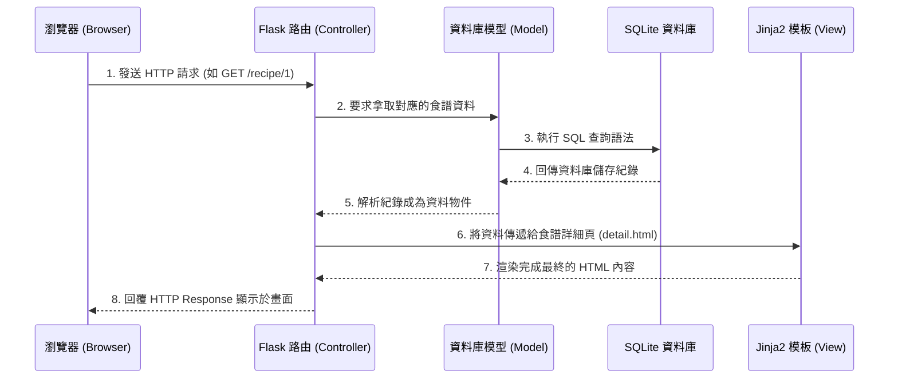

# 系統架構設計 (System Architecture)

## 1. 技術架構說明

本專案採用經典的伺服器端渲染 (Server-Side Rendering, SSR) 架構，而非單純的前後端分離。透過輕量級的後端框架與模板引擎，能以最簡單且有效率的方式達成我們的產品需求。

**選用技術與原因：**
- **後端：Python + Flask**。Flask 是一個極輕量且具備高彈性的 Python Web 框架，適合用來快速開發中小型網頁應用，設定簡單且內建許多好用的開發工具，十分符合此專案 MVP 的需求。
- **模板引擎：Jinja2**。Flask 內建整合的 Jinja2 模板引擎，可以讓我們在 HTML 頁面中混入 Python 變數與邏輯（例如透過迴圈來顯示食譜清單），頁面會由 Flask 後端先渲染完成後，再回傳給瀏覽器顯示。
- **資料庫：SQLite**。SQLite 是一個單一檔案型的關聯式資料庫系統，無需額外安裝或設定資料庫伺服器環境就能運作，非常便於開發與測試。我們會透過 Python 內建的 `sqlite3` 或 ORM (如 SQLAlchemy) 進行操作。

**Flask MVC 模式說明：**
本專案會參考 MVC（Model-View-Controller）的分層概念進行應用組織：
- **Model (資料模型)：** 負責定義資料庫的表格結構與資料操作邏輯。在此專案中包含「使用者」與「食譜 (含食材、作法)」的儲存架構。
- **View (視圖)：** 負責呈現使用者介面。此部分即為由 Jinja2 引擎根據資料渲染出來的 HTML 模板，負責所有畫面呈現 (`templates/` 目錄)。
- **Controller (控制器)：** 在 Flask 中主要實作為「路由 (Routes)」。負責接收使用者的要求 (Request)，拿取或寫入資料庫模型 (Model) 資料，最後再將資料送到 View (Jinja2 模板) 中並回傳結果給使用者。

---

## 2. 專案資料夾結構

我們建議的資料夾結構如下，以明確分離關注點，方便未來專案擴充：

```text
web_app_development/
├── app/                      # 應用程式主程式碼目錄
│   ├── models/               # [Model] 資料庫模型定義與操作邏輯
│   │   ├── user.py           # 使用者資料表模型
│   │   └── recipe.py         # 食譜（含食材、步驟）的模型
│   ├── routes/               # [Controller] 負責提供 Flask 路由
│   │   ├── auth.py           # 帳號機制（登入、註冊模組）
│   │   ├── recipe.py         # 食譜主體操作（新增、清單、搜尋）
│   │   └── admin.py          # 後台管理功能路由
│   ├── templates/            # [View] 存放 Jinja2 HTML 模板
│   │   ├── base.html         # 母版（含共用的頂端導覽列、頁尾、載入資源）
│   │   ├── index.html        # 首頁（顯示食譜列表）
│   │   ├── detail.html       # 食譜詳細頁面介紹
│   │   └── form.html         # 新增/編輯食譜的表單頁面
│   └── static/               # 靜態資源檔案目錄
│       ├── css/              # 網頁樣式表 (style.css)
│       └── js/               # 前端腳本檔案
├── docs/                     # 專案說明文件目錄
│   ├── PRD.md                # 產品需求文件
│   └── ARCHITECTURE.md       # 本文件：系統架構設計
├── instance/                 # Flask 預設保護資源的資料夾
│   └── database.db           # SQLite 資料庫檔案
├── requirements.txt          # Python 依賴的第三方套件清單
└── app.py                    # Flask 應用程式的進入點 (Entry Point)
```

---

## 3. 元件關係圖

以下透過圖表展示系統收到使用者操作（如：查看某個食譜）的運作流程：



---

## 4. 關鍵設計決策

1. **採用伺服器端渲染 (SSR) 而非前後端分離**
   - **原因**：考量此專案重點在於食譜資訊呈現，不需太頻繁的無刷新介面互動。以 Flask + Jinja2 產出 HTML，可大幅減少初期開發負擔並加快專案上線速度，維護也只需專注在單一程式碼庫中。

2. **路由邏輯按模組化拆分 (Blueprints)**
   - **原因**：將不同的權限或功能拆分成獨立的 `route`（例如：一般使用者操作歸在 `recipe.py`，管理員相關在 `admin.py`），而不是全部擠在 `app.py` 中。這能讓程式碼變得好讀與易於維護擴充。

3. **統一共用模板架構 (`base.html`)**
   - **原因**：所有內部頁面（首頁、詳細頁、新增頁等）透過 Jinja2 模板繼承，重複利用包含主要網頁架構與外觀資源的 `base.html`，減少重複程式碼，確保網站上下的視覺呈現一致性。

4. **採用 SQLite 解決方案**
   - **原因**：對於初期 MVP 專案，單一檔案即資料庫有極好的開發體驗，並省下網路連線配置的繁瑣程序。若未來流量成長，程式層可憑藉 Python ORM 介面快速搬移到 PostgreSQL 等更強大的資料庫中。
