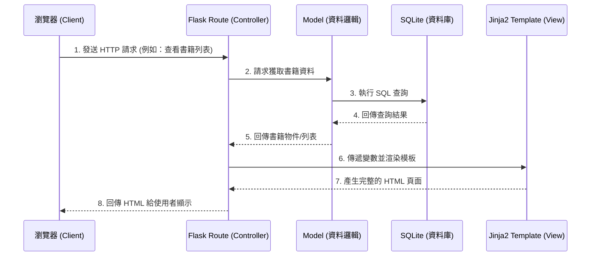

# 二手書交換平台系統 - 系統架構文件 (Architecture Document)

## 1. 技術架構說明

本系統採用以 Python 為基礎的網頁開發技術，這是一套適合快速開發、輕量且易於維護的技術組合。

### 選用技術與原因
- **後端框架：Flask**
  - 原因：輕量、彈性高，適合中小型專案或 MVP 開發，能夠讓開發者自由掌握目錄結構與擴充套件。
- **模板引擎：Jinja2**
  - 原因：與 Flask 原生整合良好，能將後端變數無縫嵌入 HTML 頁面中動態渲染，達到伺服器端渲染 (SSR) 的效果。
- **資料庫：SQLite**
  - 原因：無需額外安裝資料庫伺服器，資料儲存在單一檔案中，適合初期開發、測試以及中小型校園系統的資料負載量。

### Flask MVC 模式說明
雖然 Flask 沒有強制規定結構，但本專案將採用類似 MVC (Model-View-Controller) 的設計模式來分離職責：
- **Model (模型)**：負責定義資料結構與資料庫操作（例如：User、Book、Message 模型），直接與 SQLite 溝通。
- **View (視圖)**：負責呈現使用者介面，由 Jinja2 的 HTML 模板與前端 CSS/JS 構成。
- **Controller (控制器)**：由 Flask 的 Routes (路由) 擔任，負責接收使用者請求、調用 Model 處理資料邏輯，最後將結果傳遞給 View 進行渲染。

---

## 2. 專案資料夾結構

以下為本專案的資料夾與檔案組織方式：

```text
web_app_development/
├── app/
│   ├── __init__.py      # Flask 應用程式初始化檔案（建立 app 實例、設定資料庫）
│   ├── models/          # Model：資料庫模型定義 (SQLite 資料表)
│   │   ├── __init__.py
│   │   ├── user.py      # 用戶模型 (一般學生、系學會)
│   │   ├── book.py      # 書籍與上架模型
│   │   ├── request.py   # 預約與交易狀態模型
│   │   └── message.py   # 留言與私訊模型
│   ├── routes/          # Controller：Flask 路由與視圖函數
│   │   ├── __init__.py
│   │   ├── auth.py      # 註冊、登入等驗證路由
│   │   ├── book.py      # 書籍上架、瀏覽、搜尋路由
│   │   ├── user.py      # 個人書櫃、狀態管理路由
│   │   └── message.py   # 留言板與私訊路由
│   ├── templates/       # View：Jinja2 HTML 模板
│   │   ├── base.html    # 網頁共用版型（Navbar, Footer）
│   │   ├── auth/        # 登入與註冊頁面
│   │   ├── book/        # 書籍列表、書籍詳細資訊、上架表單
│   │   └── user/        # 個人書櫃、預約管理頁面
│   └── static/          # 前端靜態資源
│       ├── css/         # 樣式表 (style.css)
│       ├── js/          # 互動腳本 (main.js)
│       └── images/      # 圖片與書籍照片上傳目錄
├── instance/
│   └── database.db      # SQLite 資料庫檔案（運行時自動產生，不進版控）
├── docs/
│   ├── PRD.md           # 產品需求文件
│   └── ARCHITECTURE.md  # 系統架構文件（本文件）
├── requirements.txt     # Python 依賴套件清單 (如 flask, werkzeug 等)
└── run.py               # 專案啟動入口
```

---

## 3. 元件關係圖

以下展示使用者在瀏覽器操作時，系統內部的資料流動與元件協作：


```mermaid
sequenceDiagram
    participant Browser as 瀏覽器 (Client)
    participant Route as Flask Route (Controller)
    participant Model as Model (資料邏輯)
    participant DB as SQLite (資料庫)
    participant Template as Jinja2 Template (View)

    Browser->>Route: 1. 發送 HTTP 請求 (例如：查看書籍列表)
    Route->>Model: 2. 請求獲取書籍資料
    Model->>DB: 3. 執行 SQL 查詢
    DB-->>Model: 4. 回傳查詢結果
    Model-->>Route: 5. 回傳書籍物件/列表
    Route->>Template: 6. 傳遞變數並渲染模板
    Template-->>Route: 7. 產生完整的 HTML 頁面
    Route-->>Browser: 8. 回傳 HTML 給使用者顯示
```

---

## 4. 關鍵設計決策

1. **單一資料庫與不需分庫分表設計**
   - **決策**：使用單一 SQLite 檔案處理所有儲存需求。
   - **原因**：初期用戶僅限於校內學生，流量與併發讀寫需求不高，SQLite 足以應付。未來若需要擴展，Flask 可以輕易轉移到 PostgreSQL 甚至 MySQL。

2. **伺服器端渲染 (SSR)**
   - **決策**：不採用前端框架（如 React/Vue）進行前後端分離，直接透過 Flask + Jinja2 回傳 HTML。
   - **原因**：能加快初期開發速度，減少 API 設計與前端框架學習成本，且對簡單的表單提交與頁面跳轉來說，SSR 已經非常足夠。

3. **使用者密碼安全機制**
   - **決策**：資料庫絕不能明碼儲存密碼，採用 `werkzeug.security` 的 Hash 加密功能。
   - **原因**：即使系統的資料庫（如 SQLite 檔案）外洩，也能保護學生的密碼不被輕易破解，符合基本的安全考量。

4. **Blueprint (藍圖) 模組化路由**
   - **決策**：將路由依照功能切分成 `auth`, `book`, `user`, `message` 多個模組，而非全部寫在一個檔案中。
   - **原因**：防止單一檔案過於龐大，有利於團隊分工合作，確保專案具備良好的可維護性與可讀性。
