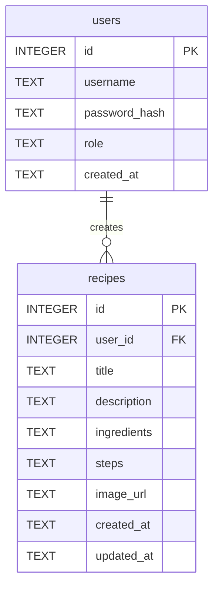

# 資料庫設計文件 (Database Design)

本文件描述「食譜收藏夾系統」的資料庫結構。我們採用 SQLite 作為資料庫系統，包含 `users` (使用者) 與 `recipes` (食譜) 兩個資料表。

## 1. ER 圖（實體關係圖）

## 2. 資料表詳細說明

### 2.1 系統使用者 (`users`)

儲存系統的使用者資料，包含登入帳號、密碼。

| 欄位名稱        | 資料型別 | 屬性 / 預設值                    | 說明                            |
|----------------|----------|---------------------------------|---------------------------------|
| `id`           | INTEGER  | PRIMARY KEY AUTOINCREMENT       | 使用者唯一識別碼，主鍵。          |
| `username`     | TEXT     | NOT NULL UNIQUE                 | 使用者登入帳號，不可重複。        |
| `password_hash`| TEXT     | NOT NULL                        | 經過加密的密碼 hash 值。          |
| `role`         | TEXT     | DEFAULT 'user'                  | 角色權限 (`user` 或 `admin`)。  |
| `created_at`   | TEXT     | DEFAULT CURRENT_TIMESTAMP       | 帳號建立時間。                    |

### 2.2 食譜資料 (`recipes`)

儲存使用者建立的食譜，包含配方、食材與作法。

| 欄位名稱        | 資料型別 | 屬性 / 預設值                    | 說明                            |
|----------------|----------|---------------------------------|---------------------------------|
| `id`           | INTEGER  | PRIMARY KEY AUTOINCREMENT       | 食譜唯一識別碼，主鍵。            |
| `user_id`      | INTEGER  | NOT NULL, FK to `users(id)`     | 關聯到作者(`users`表的id)，外鍵。|
| `title`        | TEXT     | NOT NULL                        | 食譜名稱。                        |
| `description`  | TEXT     |                                 | 食譜簡介。                        |
| `ingredients`  | TEXT     | NOT NULL                        | 所需食材 (純文字或 JSON 格式)。    |
| `steps`        | TEXT     | NOT NULL                        | 料理作法步驟 (純文字或 JSON 格式)。|
| `image_url`    | TEXT     |                                 | 成品圖片網址。                    |
| `created_at`   | TEXT     | DEFAULT CURRENT_TIMESTAMP       | 食譜建立時間。                    |
| `updated_at`   | TEXT     | DEFAULT CURRENT_TIMESTAMP       | 食譜最後更新時間。                |
