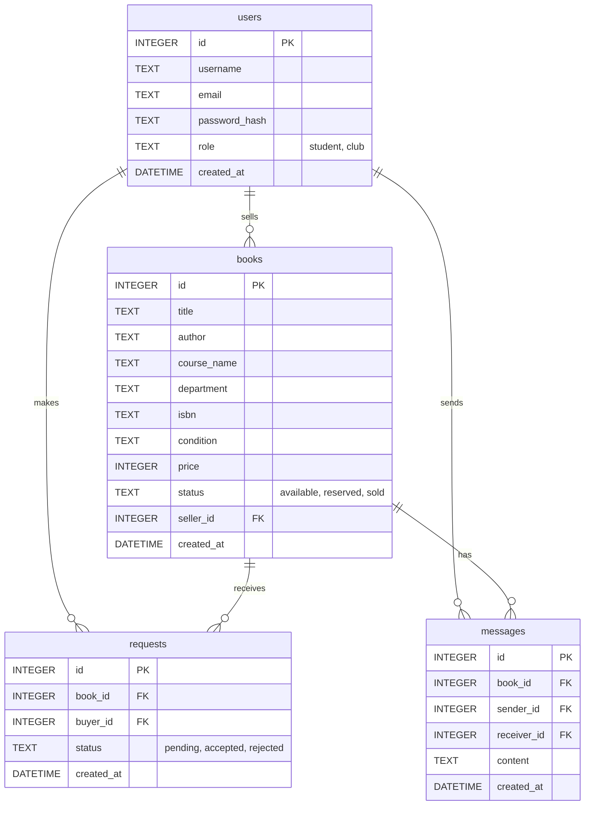

# 二手書交換平台系統 - 資料庫設計文件 (DB Design)

## 1. ER 圖 (實體關係圖)

```mermaid
erDiagram
    users {
        INTEGER id PK
        TEXT username
        TEXT email
        TEXT password_hash
        TEXT role "student, club"
        DATETIME created_at
    }
    
    books {
        INTEGER id PK
        TEXT title
        TEXT author
        TEXT course_name
        TEXT department
        TEXT isbn
        TEXT condition
        INTEGER price
        TEXT status "available, reserved, sold"
        INTEGER seller_id FK
        DATETIME created_at
    }

    requests {
        INTEGER id PK
        INTEGER book_id FK
        INTEGER buyer_id FK
        TEXT status "pending, accepted, rejected"
        DATETIME created_at
    }

    messages {
        INTEGER id PK
        INTEGER book_id FK
        INTEGER sender_id FK
        INTEGER receiver_id FK
        TEXT content
        DATETIME created_at
    }

    users ||--o{ books : "sells"
    users ||--o{ requests : "makes"
    users ||--o{ messages : "sends"
    books ||--o{ requests : "receives"
    books ||--o{ messages : "has"
```

## 2. 資料表詳細說明

### users (使用者表)
儲存一般學生與系學會的帳號資訊。
- `id`: INTEGER, Primary Key, 自動遞增。
- `username`: TEXT, 必填, 使用者名稱。
- `email`: TEXT, 必填, 唯一, 登入用的信箱。
- `password_hash`: TEXT, 必填, 加密後的密碼。
- `role`: TEXT, 必填, 角色權限 (`student` 或 `club`)。
- `created_at`: DATETIME, 必填, 預設為當前時間。

### books (書籍表)
儲存所有上架的二手書資訊。
- `id`: INTEGER, Primary Key, 自動遞增。
- `title`: TEXT, 必填, 書名。
- `author`: TEXT, 必填, 作者。
- `course_name`: TEXT, 選填, 適用課程。
- `department`: TEXT, 選填, 適用科系。
- `isbn`: TEXT, 選填, 國際標準書號。
- `condition`: TEXT, 必填, 書況描述。
- `price`: INTEGER, 必填, 售價(0表示交換)。
- `status`: TEXT, 必填, 書籍狀態 (`available`, `reserved`, `sold`)。
- `seller_id`: INTEGER, 必填, 外鍵關聯 `users.id`。
- `created_at`: DATETIME, 必填, 上架時間。

### requests (預約請求表)
儲存買家對特定書籍的購買/預約請求。
- `id`: INTEGER, Primary Key, 自動遞增。
- `book_id`: INTEGER, 必填, 外鍵關聯 `books.id`。
- `buyer_id`: INTEGER, 必填, 外鍵關聯 `users.id`。
- `status`: TEXT, 必填, 請求狀態 (`pending`, `accepted`, `rejected`)。
- `created_at`: DATETIME, 必填, 發出請求時間。

### messages (留言與私訊表)
儲存針對書籍的公開留言或買賣雙方的私訊對話。
- `id`: INTEGER, Primary Key, 自動遞增。
- `book_id`: INTEGER, 必填, 外鍵關聯 `books.id`。
- `sender_id`: INTEGER, 必填, 發送者 `users.id`。
- `receiver_id`: INTEGER, 選填, 接收者 `users.id` (若為公開留言則為空)。
- `content`: TEXT, 必填, 留言/訊息內容。
- `created_at`: DATETIME, 必填, 留言時間。
