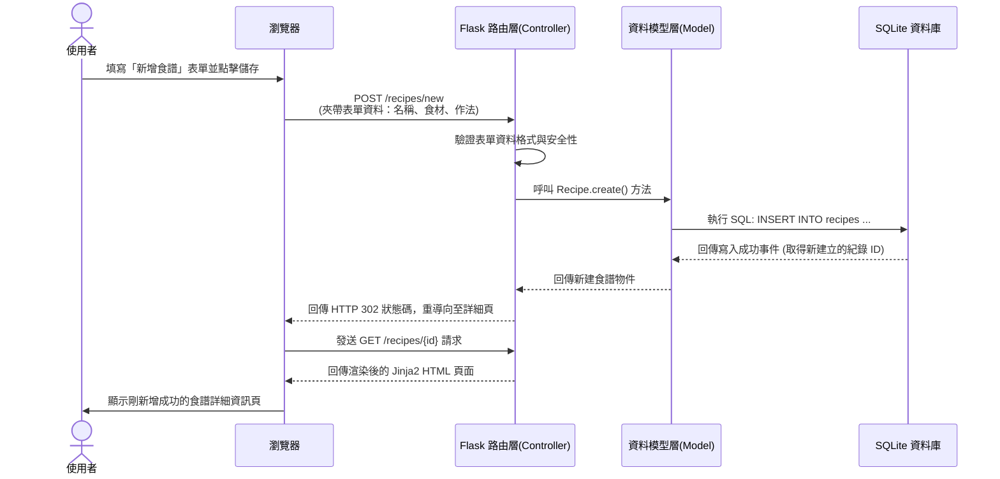

# 流程與功能設計 (Flowcharts & System Flows)

本文件透過視覺化的流程圖與序列表，展示「食譜收藏夾系統」的使用者體驗路徑以及系統內部的資料流動歷程。

## 1. 使用者流程圖（User Flow）

此流程圖展示一般使用者進入系統後，可以執行的各種主要行動路徑（包含瀏覽、尋找配方、以及新增與編輯食譜）。

```mermaid
flowchart TD
    A([使用者造訪網站]) --> B[首頁: 食譜總覽與搜尋列]
    B --> C{使用者想要做什麼？}
    
    C -->|輸入關鍵字搜尋| D[搜尋結果列表]
    C -->|查看特定食譜| E[食譜詳細資訊頁<br/>(含食材介紹與作法步驟)]
    C -->|新增自己的食譜| F[新增食譜表單頁]
    
    D -->|點擊結果| E
    
    E --> G{若是該食譜作者<br/>或管理員}
    G -->|可以| H[進行編輯或刪除]
    H -->|選擇刪除| B
    H -->|選擇編輯| I[編輯食譜表單頁]
    I -->|儲存變更| E
    
    F -->|填妥資料並送出| E
```

---

## 2. 系統序列圖（Sequence Diagram）

此序列圖描述核心功能之一：「使用者新增食譜」時，前端瀏覽器、後端介面 (Flask)、資料模型與資料庫 (SQLite) 之間的互動時序。



---

## 3. 功能清單與 API 對照表

本表列出系統內每個操作對應到的 URL 路徑及 HTTP 方法（設計風格偏向 RESTful 精神，並配合 HTML 頁面表單的傳統 GET/POST 方式操作）。

| 功能描述 | HTTP 方法 | URL 路徑 (Route) | 負責的畫面或邏輯 |
| --- | --- | --- | --- |
| 瀏覽食譜總覽 (首頁) | `GET` | `/` 或 `/recipes` | 顯示所有食譜縮圖或列表清單 |
| 顯示新增食譜表單頁 | `GET` | `/recipes/new` | 呈現空白的食譜輸入表單 `form.html` |
| 接收參數並建檔 (儲存食譜) | `POST` | `/recipes/new` | 將收到的表單資料存入 SQLite |
| 查看特定食譜 (含食材/作法) | `GET` | `/recipes/<id>` | 呈現單一食譜畫面的詳細資料 `detail.html` |
| 顯示編輯食譜表單頁 | `GET` | `/recipes/<id>/edit` | 呈現帶有預設原始資料的表單 `form.html` |
| 更新特定食譜 (儲存編輯) | `POST` | `/recipes/<id>/edit` | 更新 SQLite 中的特定食譜資訊 |
| 刪除特定食譜 | `POST` | `/recipes/<id>/delete`| 自 SQLite 刪除該紀錄並導回首頁 |
| 搜尋食譜 | `GET` | `/recipes/search` | 依據 `?q=` 參數過濾並回傳食譜清單 |
