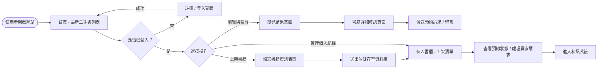
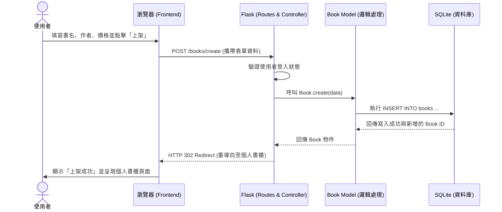

# 二手書交換平台系統 - 流程圖文件 (Flowchart Document)

本文件根據 PRD 需求與系統架構設計，視覺化使用者的操作路徑與系統內部的資料流動。

---

## 1. 使用者流程圖 (User Flow)

這張圖展示了使用者進入網站後，可能進行的主要操作路徑，包含瀏覽書籍、登入註冊、上架書籍以及預約書籍。

```mermaid
flowchart LR
    A([使用者開啟網站]) --> B[首頁 - 最新二手書列表]
    B --> C{是否已登入？}
    C -->|否| D[註冊 / 登入頁面]
    C -->|是| E{選擇操作}
    
    D -->|成功| B
    
    E -->|瀏覽與搜尋| F[搜尋結果頁面]
    F --> G[書籍詳細資訊頁面]
    G --> H[發送預約請求 / 留言]
    
    E -->|上架書籍| I[填寫書籍資訊表單]
    I --> J[送出並儲存至資料庫]
    J --> K[個人書櫃 - 上架清單]
    
    E -->|管理個人紀錄| K
    K --> L[查看預約狀態 / 處理買家請求]
    L --> M[進入私訊系統]
```

---

## 2. 系統序列圖 (Sequence Diagram)

這張圖展示了以「使用者上架書籍」為例的完整資料處理流程，從前端瀏覽器到後端 Flask 路由，再到 SQLite 資料庫的互動。

```mermaid
sequenceDiagram
    actor User as 使用者
    participant Browser as 瀏覽器 (Frontend)
    participant Flask as Flask (Routes & Controller)
    participant Model as Book Model (邏輯處理)
    participant DB as SQLite (資料庫)

    User->>Browser: 填寫書名、作者、價格並點擊「上架」
    Browser->>Flask: POST /books/create (攜帶表單資料)
    Flask->>Flask: 驗證使用者登入狀態
    Flask->>Model: 呼叫 Book.create(data)
    Model->>DB: 執行 INSERT INTO books ...
    DB-->>Model: 回傳寫入成功與新增的 Book ID
    Model-->>Flask: 回傳 Book 物件
    Flask-->>Browser: HTTP 302 Redirect (重導向至個人書櫃)
    Browser->>User: 顯示「上架成功」並呈現個人書櫃頁面
```

---

## 3. 功能清單與路由對照表

以下為 MVP 階段主要功能的預期 URL 路徑與對應的 HTTP 方法規劃：

| 模組 | 功能描述 | URL 路徑 (Route) | HTTP 方法 | 備註 |
| :--- | :--- | :--- | :--- | :--- |
| **Auth** | 使用者註冊頁面 | `/auth/register` | GET, POST | GET 顯示表單，POST 處理註冊邏輯 |
| **Auth** | 使用者登入頁面 | `/auth/login` | GET, POST | GET 顯示表單，POST 處理登入驗證 |
| **Auth** | 使用者登出 | `/auth/logout` | GET | 清除 Session |
| **Book** | 首頁 / 書籍列表 | `/` 或 `/books` | GET | 顯示所有書籍，支援搜尋參數 (?q=關鍵字) |
| **Book** | 書籍詳細資訊 | `/books/<book_id>` | GET | 顯示單一書籍詳細內容與留言 |
| **Book** | 新增書籍上架 | `/books/create` | GET, POST | 需登入，GET 顯示表單，POST 寫入資料 |
| **Book** | 編輯書籍資訊 | `/books/<book_id>/edit` | GET, POST | 需登入且為擁有者 |
| **Book** | 刪除書籍 | `/books/<book_id>/delete` | POST | 需登入且為擁有者 |
| **User** | 個人書櫃主頁 | `/user/dashboard` | GET | 顯示我的上架、我的預約 |
| **Request** | 發送預約請求 | `/books/<book_id>/request` | POST | 買家點擊預約按鈕 |
| **Request** | 處理預約請求 | `/requests/<req_id>/action` | POST | 賣家接受或拒絕預約 |
| **Message**| 新增留言/私訊 | `/books/<book_id>/message` | POST | 於書籍頁面下方送出留言 |
